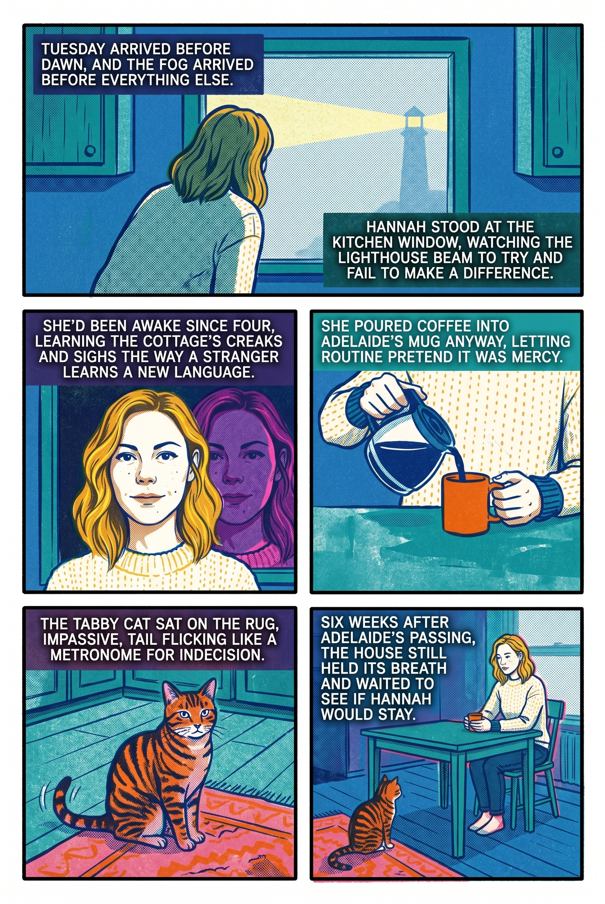
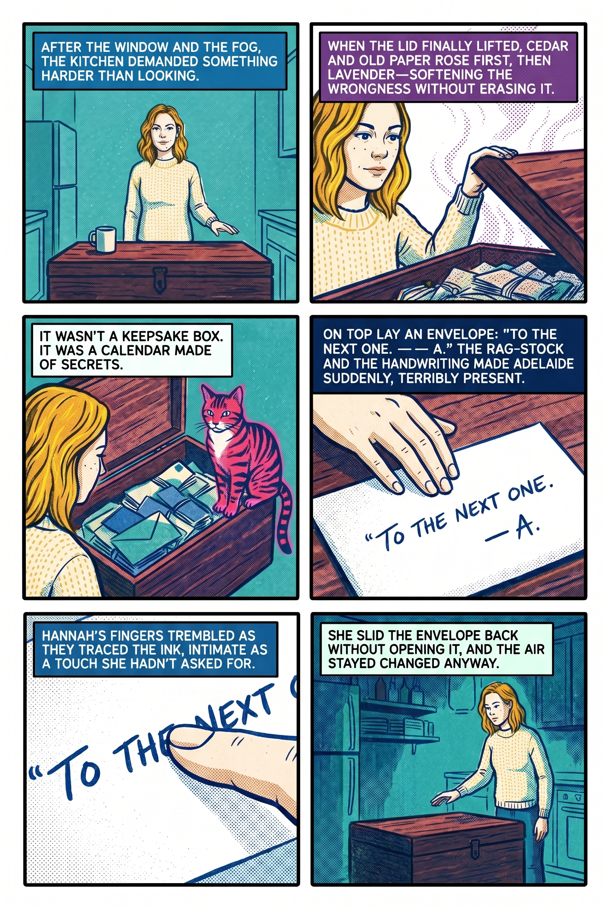
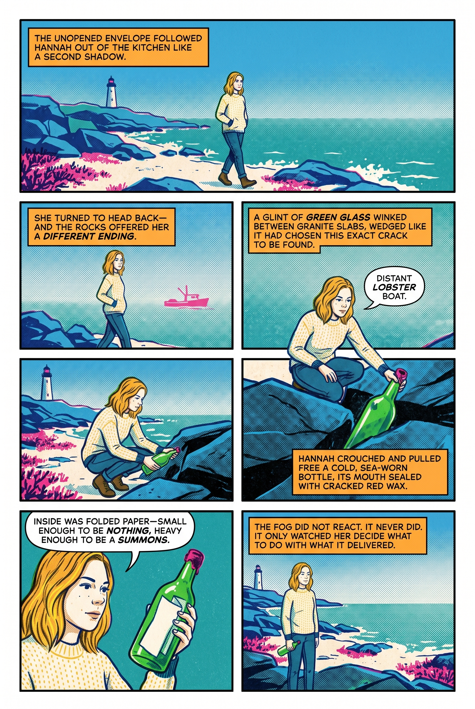
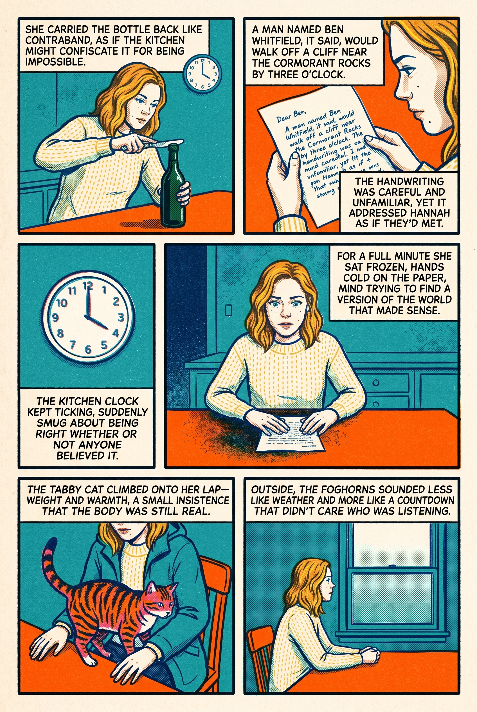
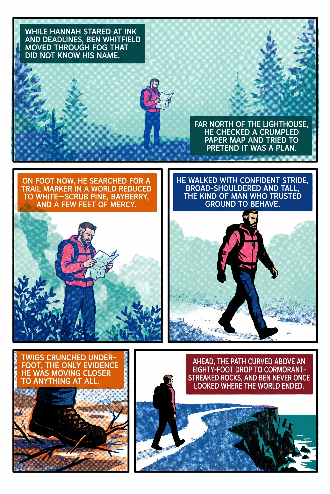
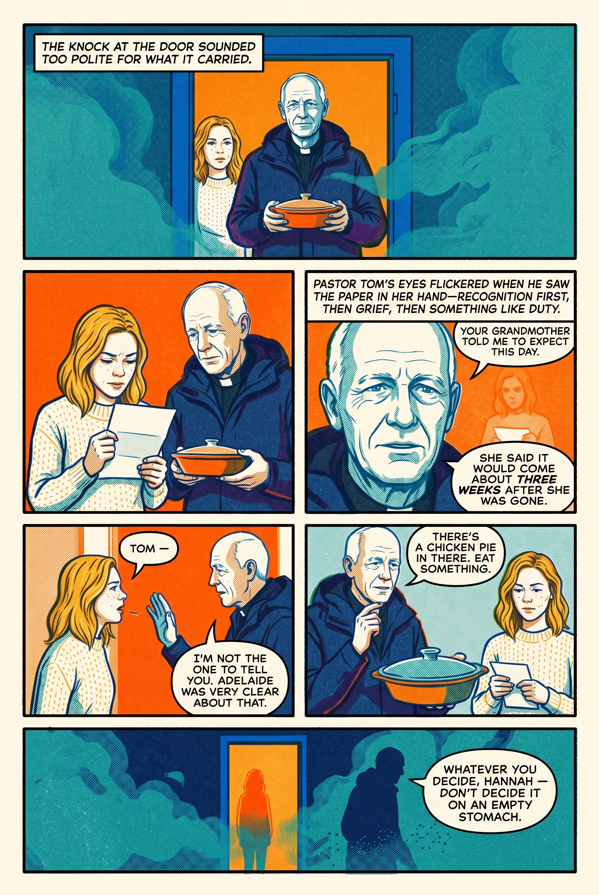
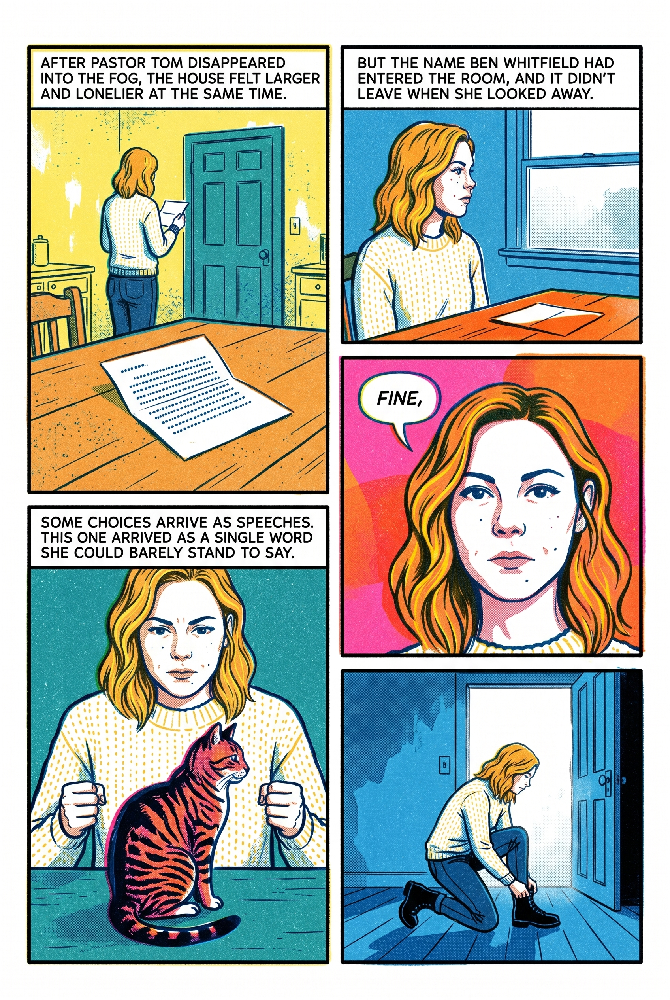
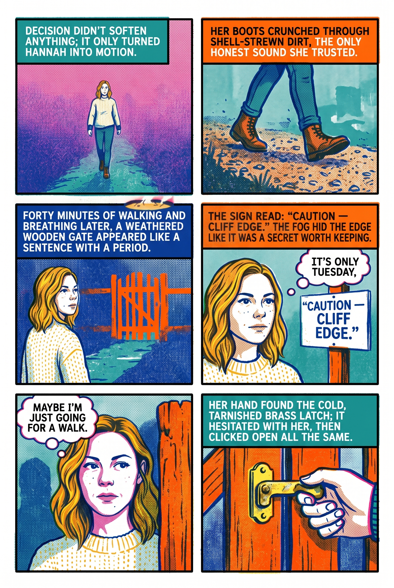
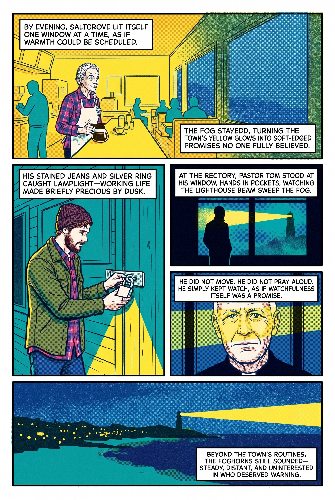
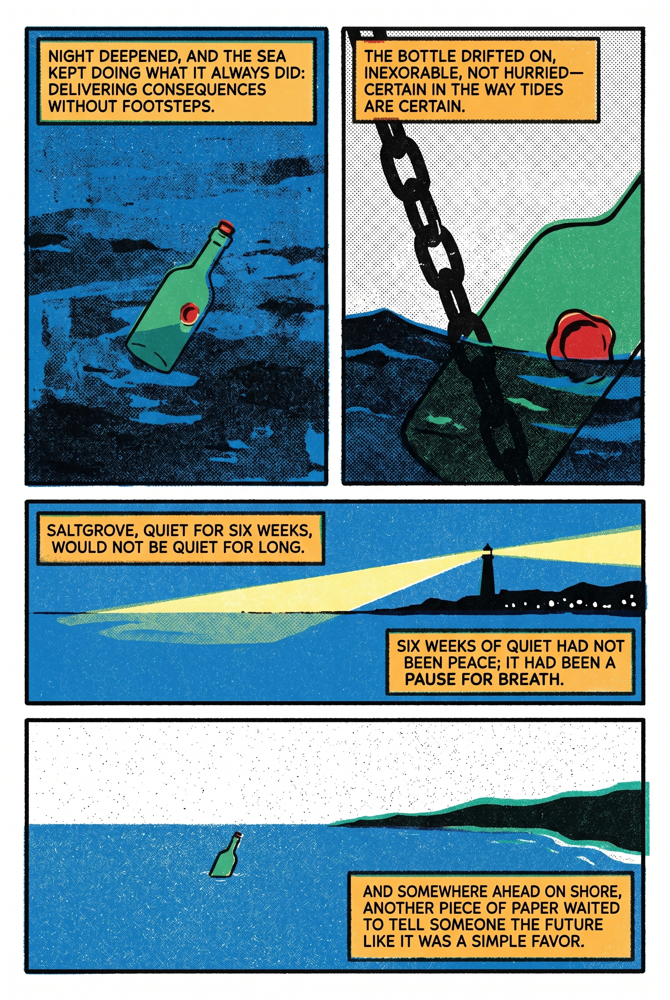

# Episode 1 — The Bottle on the Rocks

**Posted**: 2026-05-22
**Word count**: ~2,850
**Page count (rendered)**: 10
**Art style (canonical)**: Risograph
**Art styles (showcase)**: Graphic Novel, Cyanotype

---

## Synopsis

Hannah Cole's first quiet Tuesday morning in her grandmother's lighthouse cottage. She finally opens the cedar chest in the kitchen — and finds it full of unopened letters. Down on the rocks, a sealed bottle washes up. The letter inside is addressed to her by name, and describes something that hasn't happened yet.

Pastor Tom arrives with a covered casserole and a line that suggests he was expecting this day. Hannah has until three o'clock.

## Source prose

- [story.md](story.md) — the 2,850-word short story fed to the engine

## Rendered comic (Risograph style)

10 pages, generated end-to-end by the BubbleStory engine. No hand-editing, no regeneration passes.

| Page | Image |
|---|---|
| 1 |  |
| 2 |  |
| 3 |  |
| 4 |  |
| 5 |  |
| 6 |  |
| 7 |  |
| 8 |  |
| 9 |  |
| 10 |  |

## Cast in this episode

The episode draws on these reference portraits (also in the [project-level cast/ directory](../../cast/)):

| In this episode | Photo | First appears |
|---|---|---|
| Hannah Cole | [../../cast/Hannah.png](../../cast/Hannah.png) | Page 1 |
| Tom Whittaker | [../../cast/Tom.png](../../cast/Tom.png) | Page 7 |
| Cal Hartley | [../../cast/Cal.png](../../cast/Cal.png) | Page 10 (mentioned/montage) |
| Dot Bergstrom | [../../cast/Dot.png](../../cast/Dot.png) | Page 10 (mentioned/montage) |
| Adelaide Cole | [../../cast/Adelaide.png](../../cast/Adelaide.png) | Off-page (only her possessions appear) |

One character — **Ben Whitfield** (Page 6 hiker) — has **no reference photo**. The engine rendered him from prose description alone. If you're judging engine output, this is the most interesting page to look at: it's the "no-ref" baseline.

## What the engine had to figure out

- Pick 10 moments out of 2,850 words (scene pacing)
- Keep Hannah recognizable across 8 of 10 pages (character consistency)
- Render Ben Whitfield from prose alone (no-ref baseline)
- Stay in Risograph throughout (style coherence)
- Preserve Hannah's clothing (cream sweater + olive parka) across scenes
